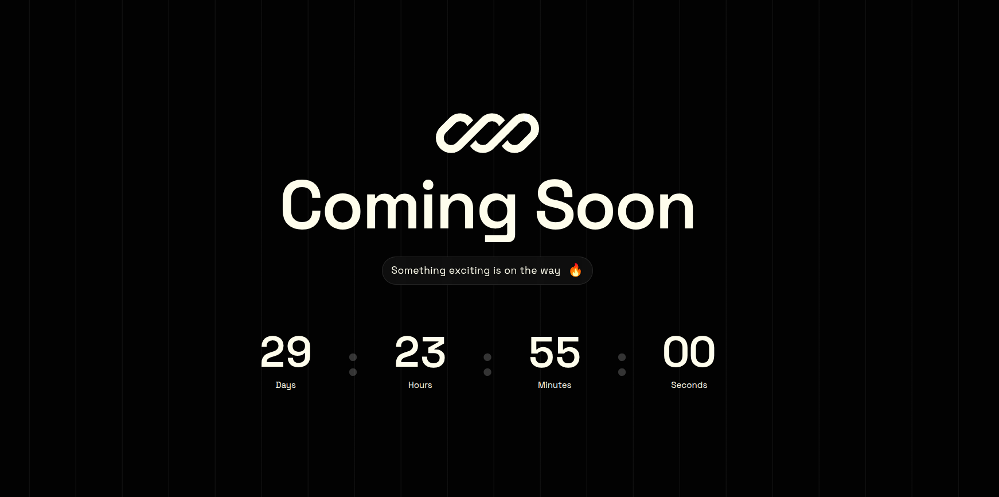

# Coming Soon

A minimalistic coming soon page built with Next.js, featuring an animated countdown timer and interactive background effects.



## Features

- Real-time countdown timer
- Animated gradient background with grid pattern
- Mouse follower dot with smooth lag animation
- Lottie animation integration
- Responsive design
- Space Grotesk typography

## Tech Stack

- Next.js 16
- React 19
- TypeScript
- Tailwind CSS 4
- Lottie React

## Getting Started

Install dependencies:

```bash
pnpm install
```

Run the development server:

```bash
pnpm run dev
```

Open [http://localhost:3000](http://localhost:3000) in your browser.

## Build

Create a production build:

```bash
pnpm run build
```

Start the production server:

```bash
pnpm start
```

## License

This project is licensed under the [MIT License](./LICENSE).


